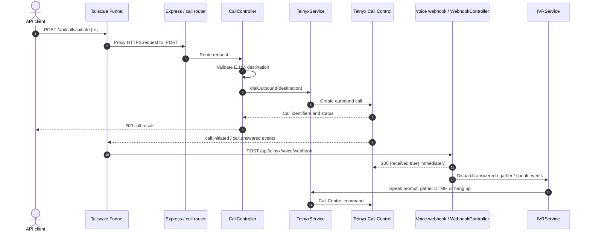
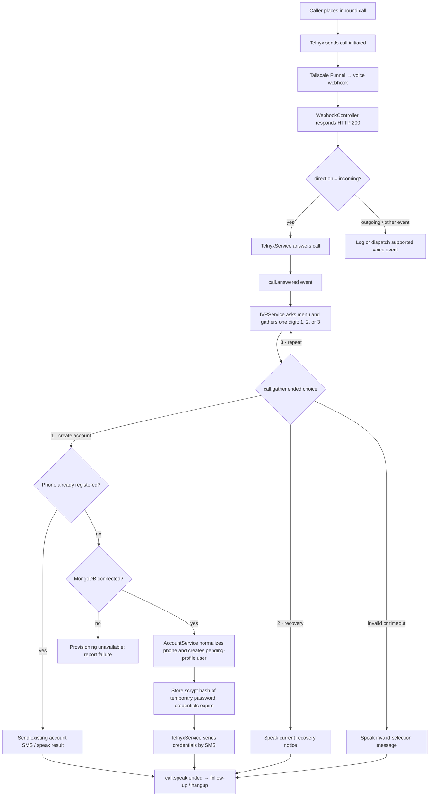
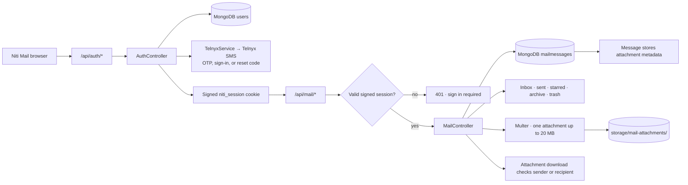

# AstraByte Architecture

This diagram reflects the current Node.js and Express application, its browser UI, telephony integration, and persistence paths.

```mermaid
flowchart LR
  subgraph users ["People and Clients"]
    browser["Browser · Niti Mail UI in public/"]
    caller["Phone caller · inbound or outbound recipient"]
  end

  subgraph network ["Public Network Ingress"]
    funnel["Tailscale Funnel · HTTPS · PUBLIC_URL"]
  end

  subgraph runtime ["AstraByte Node.js / Express Application"]
    boot["src/server.js · dotenv · connectDB() · listen 0.0.0.0:PORT"]
    dbState{"MongoDB available?"}
    express["src/app.js · CORS · JSON 2 MB · URL-encoded middleware"]
    health["GET /health · process health and uptime"]
    status["GET /api/status · service and webhook paths"]
    static["express.static(public/) · Niti Mail frontend"]
    notFound["JSON 404 · unmatched route"]

    subgraph routeLayer ["API Routers"]
      callRoutes["call.routes.js<br/>POST /api/calls/initiate"]
      voiceRoute["webhook.routes.js<br/>POST /api/telnyx/voice/webhook"]
      smsRoute["webhook.routes.js<br/>POST /api/telnyx/messaging/webhook"]
      authRoutes["auth.routes.js<br/>/api/auth/* · login, OTP, reset, profile, logout"]
      mailRoutes["mail.routes.js<br/>/api/mail/* · messages, drafts, contact picture, attachment"]
      draftSendRoutes["POST /drafts and POST /messages"]
      sessionGate["requireSession middleware"]
      uploadGate["Multer upload middleware<br/>one file · 20 MB max"]
    end

    subgraph controllerLayer ["Controllers"]
      callController["CallController<br/>E.164 validation · initiate outbound call"]
      webhookController["WebhookController<br/>acknowledge HTTP 200 · dispatch event"]
      authController["AuthController<br/>signed session · OTP · passwords · profile"]
      mailController["MailController<br/>inbox · drafts · send · state · attachments"]
    end

    subgraph serviceLayer ["Services and Models"]
      ivrService["IVRService<br/>spoken menu · DTMF choices · recovery"]
      accountService["AccountService<br/>phone normalization · user provisioning"]
      telnyxService["TelnyxService<br/>dial · answer · speak · gather · hangup · SMS"]
      userModel["User model"]
      mailModel["MailMessage model"]
    end
  end

  subgraph providers ["External Providers"]
    telnyxVoice["Telnyx Call Control API v2<br/>PSTN · TTS · DTMF · call events"]
    telnyxMessaging["Telnyx Messaging API<br/>OTP · account SMS · reset SMS · events"]
  end

  subgraph data ["Persistence"]
    mongo[("MongoDB · astrabyte<br/>users · mailmessages")]
    attachments[("Local disk · storage/mail-attachments/<br/>random UUID filenames")]
  end

  browser <-->|"HTTPS · UI and same-origin API"| funnel
  caller <-->|"PSTN voice call"| telnyxVoice
  telnyxVoice -.->|"Voice webhooks"| funnel
  telnyxMessaging -.->|"Messaging webhooks"| funnel
  funnel -->|"Reverse proxy to localhost:PORT"| express

  boot --> dbState
  dbState -->|"Connected or unavailable; server continues"| express
  express --> health
  express --> status
  express --> static
  express --> callRoutes
  express --> voiceRoute
  express --> smsRoute
  express --> authRoutes
  express --> mailRoutes
  express --> notFound
  static --> browser

  callRoutes --> callController --> telnyxService
  voiceRoute --> webhookController
  smsRoute --> webhookController
  authRoutes --> authController
  mailRoutes --> mailController
  mailRoutes --> draftSendRoutes --> sessionGate --> uploadGate --> mailController

  webhookController -->|"call events"| ivrService
  webhookController -->|"answer inbound call"| telnyxService
  ivrService --> telnyxService
  ivrService --> accountService
  accountService --> userModel --> mongo
  authController --> userModel
  mailController --> mailModel --> mongo
  mailController -->|"Validate signed session where required"| authController
  mailController --> attachments
  authController -->|"OTP / reset / sign-in code SMS"| telnyxService
  telnyxService -.->|"Call Control commands and outbound calls"| telnyxVoice
  telnyxService -.->|"Outbound SMS"| telnyxMessaging

  classDef edge fill:#fff4e5,stroke:#d88a37,color:#563612;
  classDef app fill:#edf1ff,stroke:#6675b8,color:#202b52;
  classDef service fill:#e8f6f4,stroke:#328d84,color:#164b48;
  classDef store fill:#edf4ff,stroke:#4e78aa,color:#203b5e;
  class browser,caller,funnel,telnyxVoice,telnyxMessaging edge;
  class boot,dbState,express,health,status,static,notFound,callRoutes,voiceRoute,smsRoute,authRoutes,mailRoutes,sessionGate,uploadGate,callController,webhookController,authController,mailController app;
  class ivrService,accountService,telnyxService service;
  class userModel,mailModel,mongo,attachments store;
```

## Detailed request and event flows

### Outbound call

### Inbound IVR and account provisioning

### Authentication and mail data

## Main flows

### Browser and Niti Mail

The Express app serves the `public/` frontend and routes its same-origin API requests. Authentication checks a signed `niti_session` cookie. The authentication controller reads and updates user records; the mail controller reads and updates message records and stores uploaded attachment files on disk.

### Inbound IVR call

Telnyx sends `call.initiated` to the voice webhook through Tailscale Funnel. The webhook controller answers the call through `TelnyxService`. On `call.answered`, `IVRService` starts the spoken menu and gathers DTMF digits. Option 1 provisions a user through `AccountService`, stores the user in MongoDB, and sends temporary credentials by SMS. Option 2 speaks the current recovery notice. Option 3 repeats the menu. Follow-up speech ends with a hangup command.

### Outbound call

`POST /api/calls/initiate` reaches `CallController`, which asks `TelnyxService` to dial through the configured Call Control application. Telnyx webhooks then drive the same answered, gather, speak, and hangup handlers used by the IVR.

### Authentication and SMS

The auth endpoints support login, OTP verification and resend, password changes and resets, profile completion, and profile updates. SMS delivery for login and recovery codes uses `TelnyxService`. Passwords and OTPs are hashed before persistence; the diagram intentionally excludes those secrets.

### Mail and storage

Mail routes cover inbox listing, drafts, sending, and message updates. MongoDB stores users and mail messages. Attachment metadata is stored on the mail message while attachment bytes are saved under `storage/mail-attachments`.

## Runtime and configuration

- `src/server.js` loads `.env`, attempts the MongoDB connection, and listens on `0.0.0.0` using `PORT` (default `3000`).
- Tailscale Funnel publishes `PUBLIC_URL` and proxies HTTPS traffic to `localhost:3000`.
- Telnyx uses `TELNYX_API_KEY`, `TELNYX_CALL_CONTROL_APP_ID`, `TELNYX_PHONE_NUMBER`, and optional `TELNYX_MESSAGING_PROFILE_ID`.
- IVR speech uses `TELNYX_TTS_VOICE`, `TELNYX_TTS_LANGUAGE`, and `TELNYX_TTS_SERVICE_LEVEL`.
- MongoDB uses `MONGODB_URI`. The HTTP server still starts if the database is unavailable, but account and authentication operations require a live database connection.
- `/health` reports process health; `/api/status` reports the API service and webhook paths.
